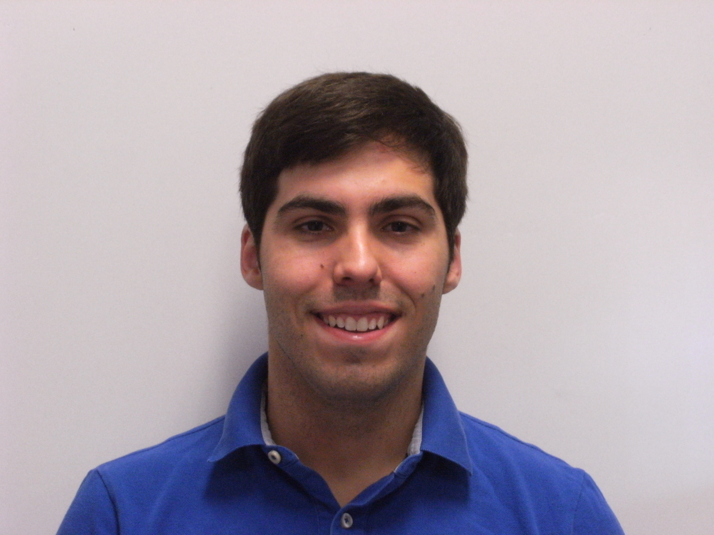

# Alex Galán
### Data Scientist
 
[Resume](https://drive.google.com/open?id=1qcwypRwYOPhGbBgmRJoiwjD7-fmVMtWh1kHWpiwBHOE)

## About Me:
I began my education in bioengineering because of my curiosity about the fundamental questions of life answerable through the scientific process, as well as my love for critical thinking and problem solving. After transitioning into industry, I found I wanted more opportunities for continuous learning and challenges. For several years, I entered an exploratory phase in which I sampled other possible opportunities. Ultimately I arrived at the conclusion that data science is the field I am most interested in pursuing because of the vast depth of knowledge to explore, innate engagement with critical thinking, and robust toolkit capable of answering truly meaningful questions across many different industries.

## Projects:
### Happy Hour Classifier
Noticing the lack of happy hour informational resources online, I set out to use data science tools to find restaurants with happy hours. Skills used: webscraping, image processing, convolutional neural network, OCR tools
Below are links to a more detailed project report and github repository. 
[Report](https://github.com/avgalan/ga_capstone/blob/master/technical_report.ipynb) 
[Github Repository](https://github.com/avgalan/ga_capstone)

### Data for Diplomas
Explored data of high school graduation rates. Used machine learning modeling to identify the most important features contributing to student graduation. 
[Github Repository](https://github.com/avgalan/ga_project_3)

#### Contact Information
linkedin: <https://www.linkedin.com/in/alex-v-galan/> 
email: <alexvgalan@gmail.com> 
github: <https://github.com/avgalan> 
